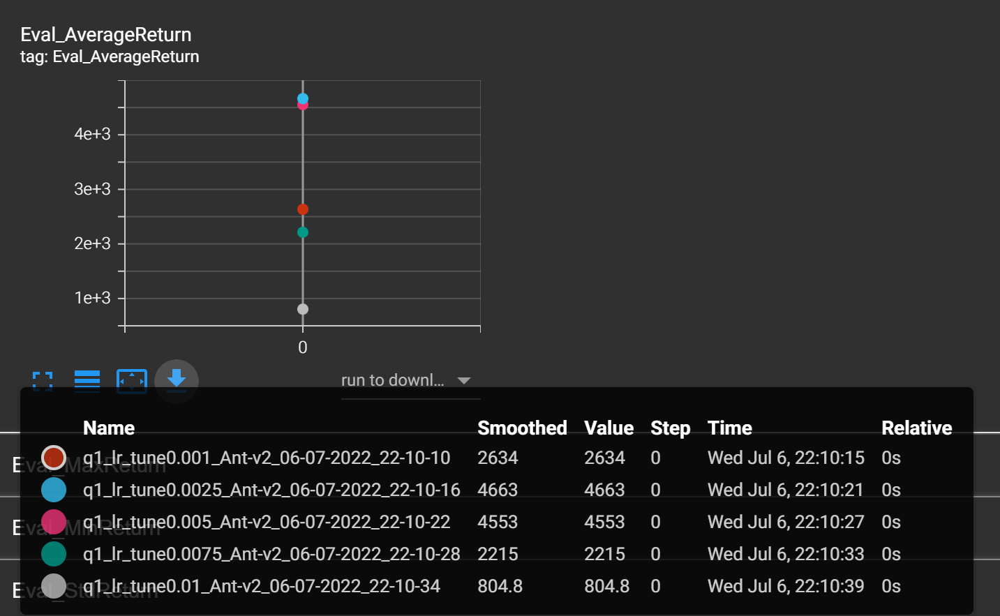
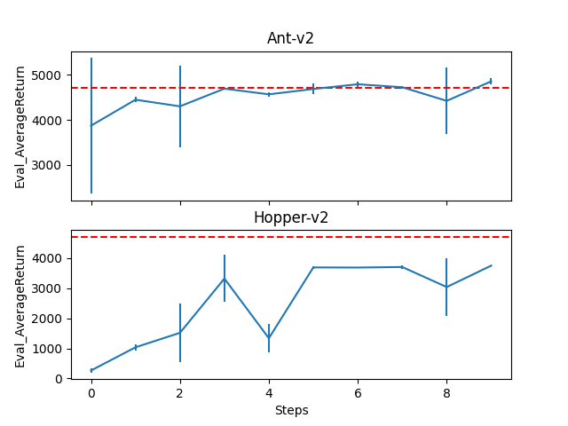

# Homework_1

## Result of T1 
Two Experinment Table:

|                     | Env-name    |             |
|---------------------|-------------|-------------|
| Index               | Ant-v2      | Hopper-v2   |
| Eval_AverageReturn  | 4526.242676 | 126.7174149 |
| Eval_StdReturn      | 102.9299927 | 87.23033142 |
| Eval_MaxReturn      | 4713.908203 | 454.8390198 |
| Eval_MinReturn      | 4442.648926 | 24.59342766 |
| Eval_AverageEpLen   | 1000        | 81.22580645 |

*details*: For Ant-v2 I use default network constructure(with a little trick of **grad_clipping** which enhance the behavior from nearly 800 to 4526! so surprising...), and it seems to do a good job! While for Hopper-v2 I use a Network with size=6 and n_layers=2(**considering that the dim of observation space is only 11 while the dim of action space is only 3**), but it seems to crash with a bad behavior.

A set of HyperParmeter Result:
|                     | lr=0.0025   | lr=0.005    | lr=0.0075   | lr=0.01     |
|---------------------|-------------|-------------|-------------|-------------|
| Eval_AverageReturn  | 4663.453613 | 4553.400391 | 2214.674072 | 804.8185425 |
| Eval_StdReturn      | 36.40826035 | 140.6016388 | 1512.504028 | 15.73772907 |
| Eval_MaxReturn      | 4714.73291  | 4709.432617 | 4320.833008 | 825.2606201 |
| Eval_MinReturn      | 4633.794434 | 4368.643066 | 838.2161865 | 786.9748535 |
| Eval_AverageEpLen   | 1000        | 1000        | 1000        | 1000        |

*a brief description*: Why I choose learning_rate? Because I think learning_rate is usually main factor of quality of the result.(experiment from supervised learning.. maybe it is not right in reinforcement learning?) and the network, for convenient, I use default constructure and the training data etc I also use the default setting. And result lies in the table above~. It seems that the choice of lr does effect the final result greatly~. A simple visualization of tensorboard is as fellow: 

## Result of T2

*details about network architecture*: Ant-v2 I use default n_layer size batch_size Eval_batch_size etc, but for indicating the progress of dagger-learning, I adjust learning-rate to **0.0025** according to the result of Table 2. For Hopper-v2, I use n_layer=2, size=16 MLP. And
other settings are keeping default.

