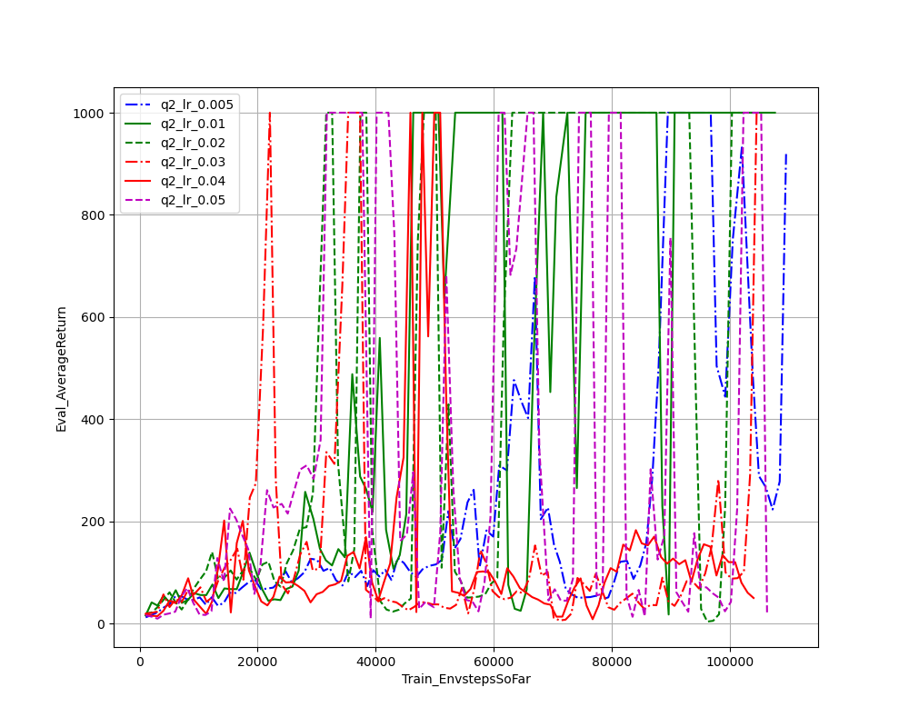
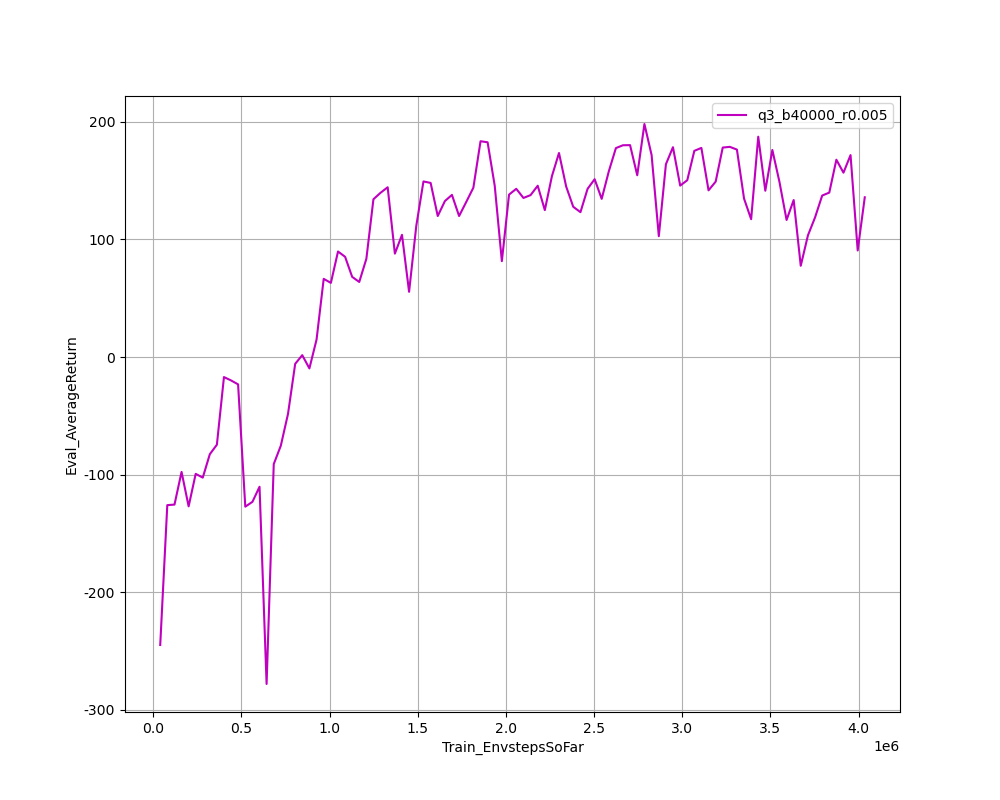
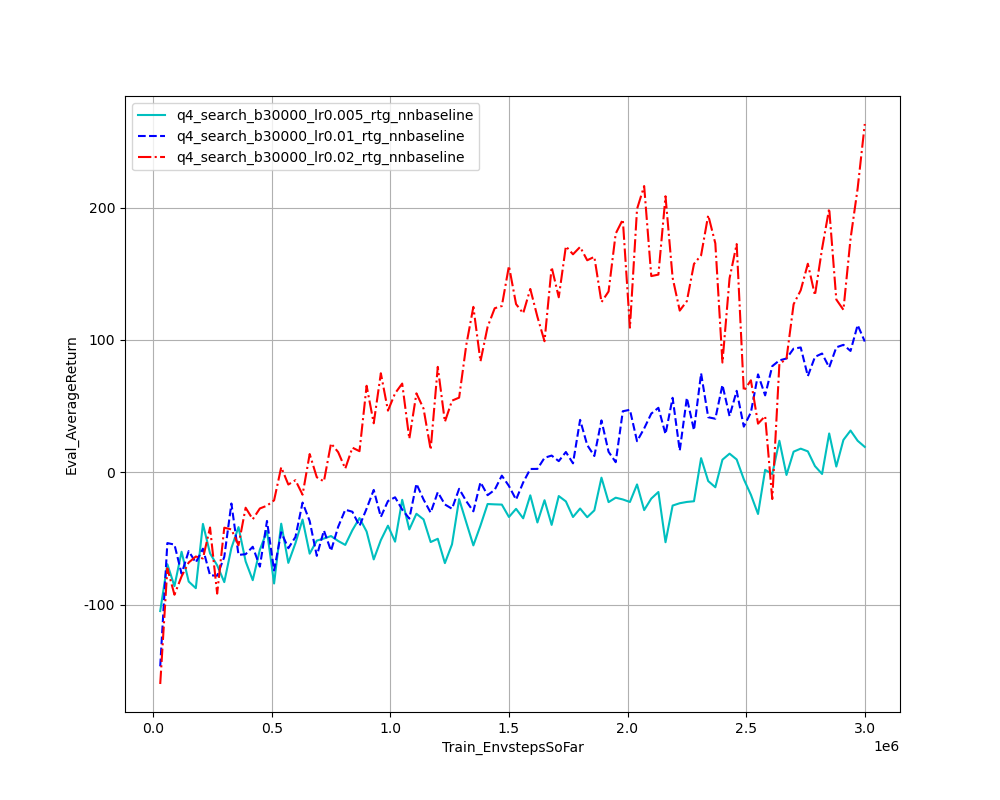
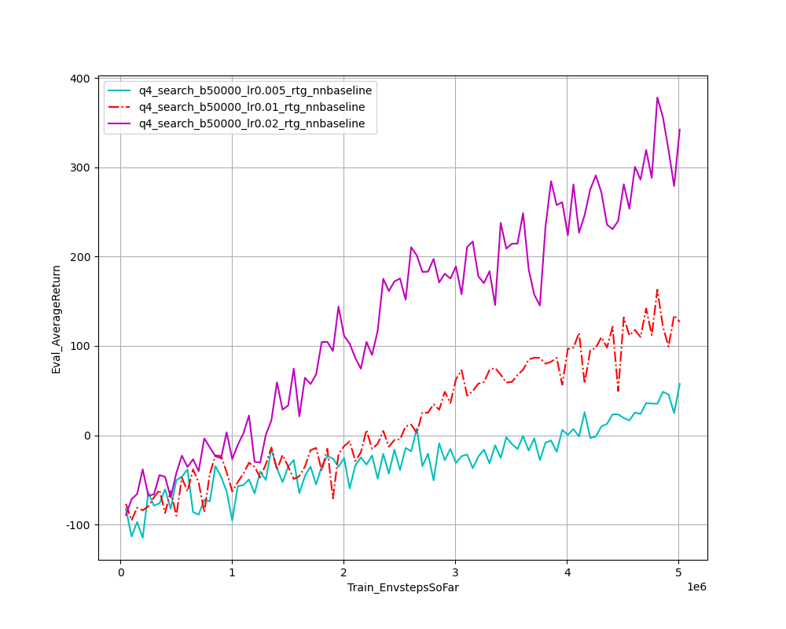

## problem 1

In Small Batchsize case, experiment with advantage standardized and rtg used has the best behavior as expectation. And as 'q1_sb_rtg_na' shows, with advantage standardized and rtg used the variance is lower and performance is better.

Compared to Small Batchsize Case, the learning curve in Large batchsize group is smoother thus reduce the variance. In the case of no advantage standardized, with rtg used, the performance enhances much more than without rtg.

## problem 2

when batchsize=3000, we can get expected score 1000 after 100 iterations and the variance is smaller than other groups.

  
when lr=0.01, the agents has more stable learning curve and reach the highest score after training. when lr is too small, the model seems not converge while lr is too large, the learning curve fluctuates.

## problem 3

the implementation get the expected 180 score after 100 iterations.

## problem 4

In this experiment, we tune learning rate in \[0.005, 0.01, 0.02\] and batchsize in \[10000, 30000, 50000 \]. and choose the best behavior which lr = 0.02, b = 50000. And different algorithm setting behaviors are as fellow

As the q1 show, the best behavior gourp is with rtg, nn_baseline and na used.

## problem 5

when gae_lambda = 0, according to the [homework pdf](hw2.pdf), due to the high bias, the behavior is much more worse than other groups. And in the end of experiments, the figure shows that when gae_lambda = 1, the learning curve fluctuate adversely, so, maybe increasing gae_lambda lead to high variance. By the way, the mean score is 500 which is much more higher than 400 noted in [homework pdf](hw2.pdf)