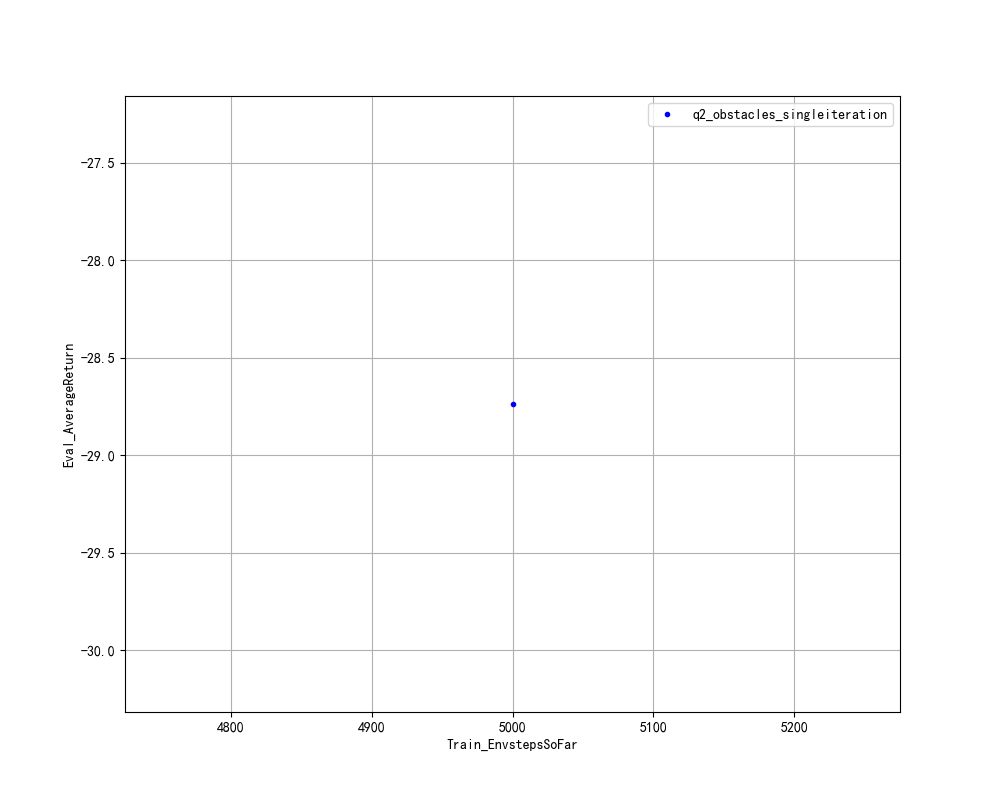
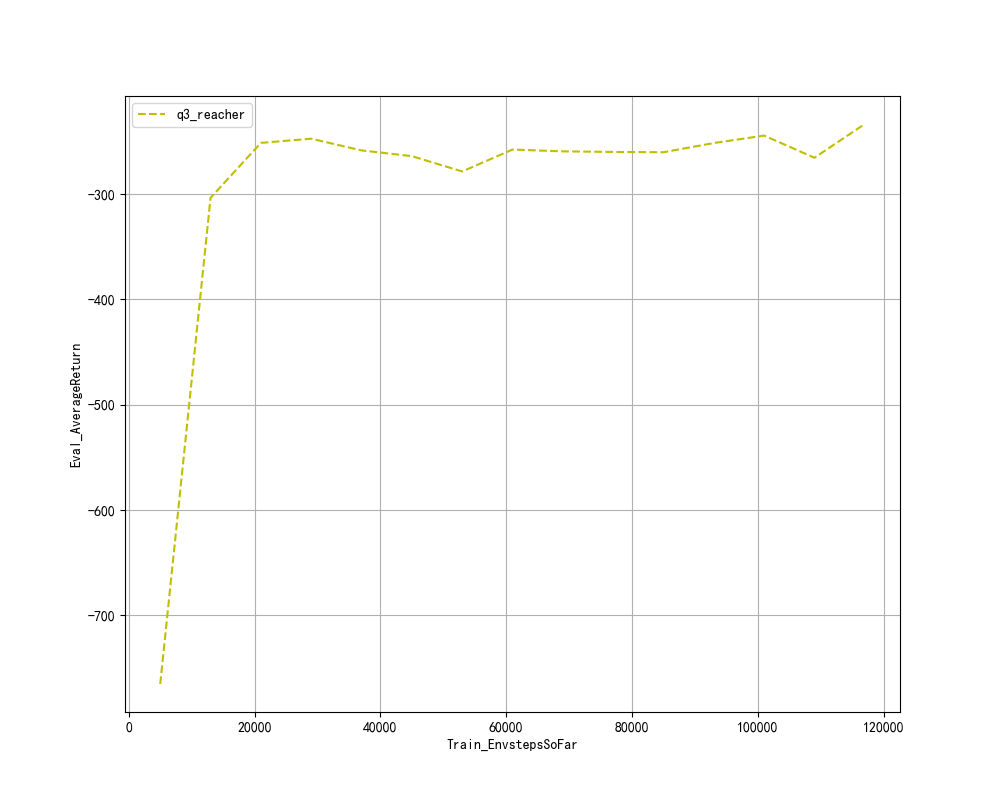
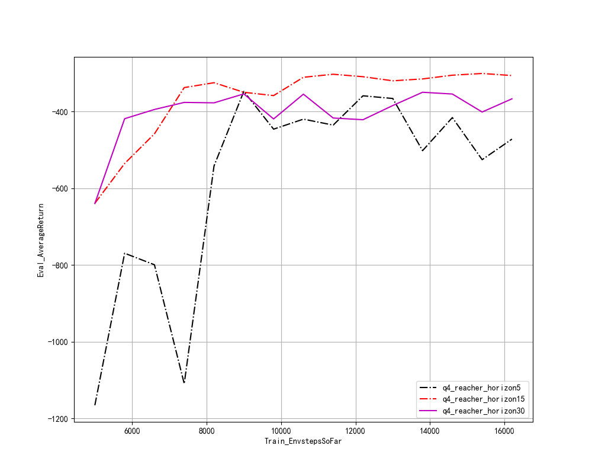
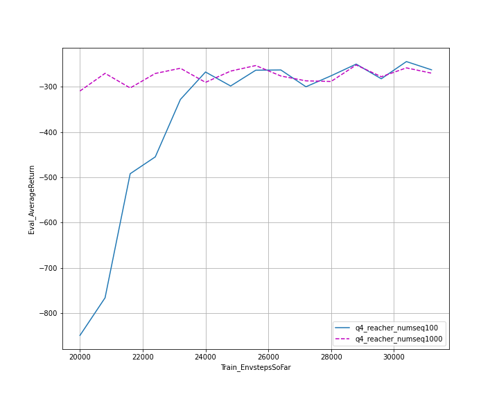
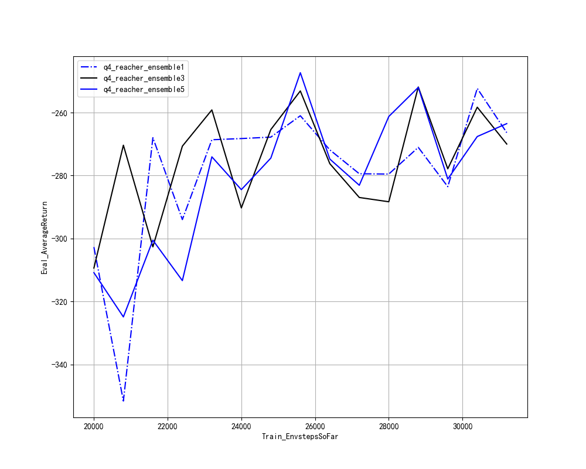
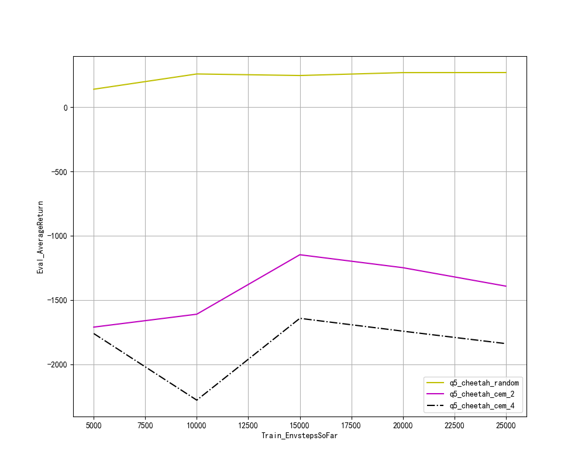

## Problem 1

as figure shown, the loss reduce below 0.2 after 500 iteration traingings. And here are the predictions of three models in question1

as the three figures shown, arch2*250 n500 groups behave best! for the reason, i think, the most import factors of MPE of prediction is the **number of train iterations**, as group whose n = 500 get the lower MPE than that one whose n = 5. Then the **expression ability** of network also makes a difference. but the influence is smaller than the number of train iterations 

## Problem 2

my implementaion of algorithm gets the expected Train_avgReturn around -160 and Eval_AvgReturn around -30 which is better than result(from -70 to -50) in [homework pdf](cs285_hw4.pdf)

## Problem 3

as the figure shown, all the score reach the requirements of the [homework pdf](cs285_hw4.pdf) 

## Problem 4

the effect of **horizon** is apparent, if the horizon is not enough, which means less information in databuffer is used, more time it takes to coverge the model. And the more horizon, the more information is taken in consideration and the behavior of the model is better.(and more time to train.)

the effect of **numseq**: it takes more time to get the nearly results with less numseq.

the effect of **ensemble**: the higher ensemble is, the less variance it suffers.

## Problem 5

it seems that algo **cem** fails which seems kind of strange? 