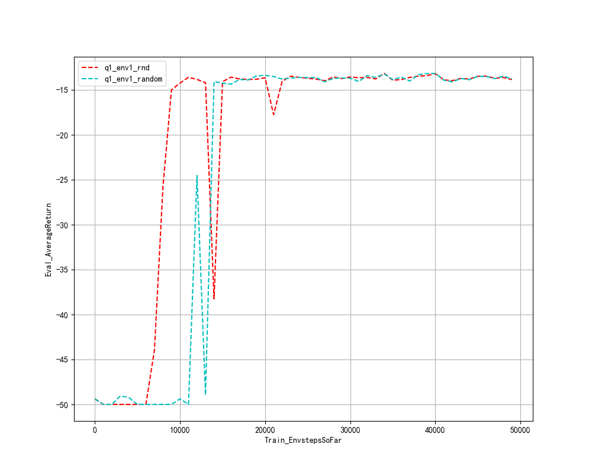
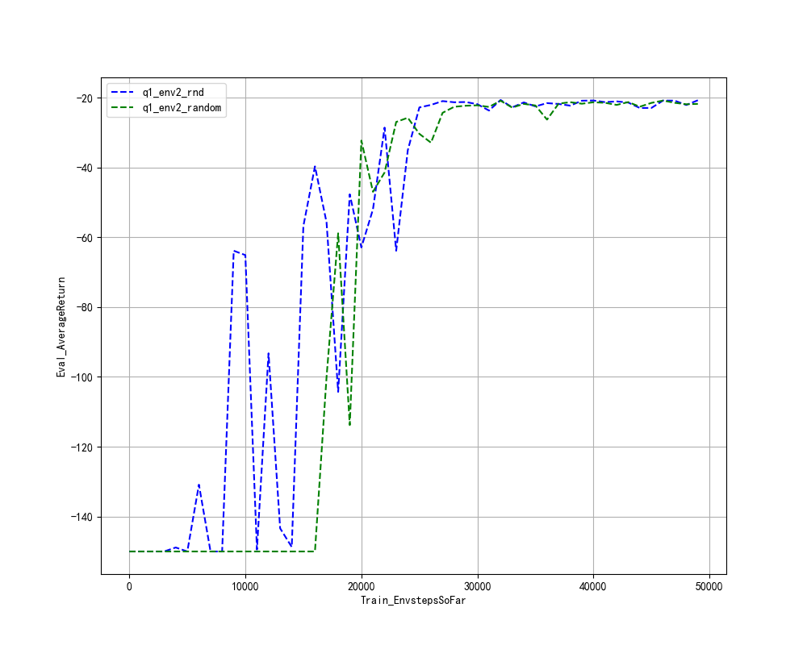
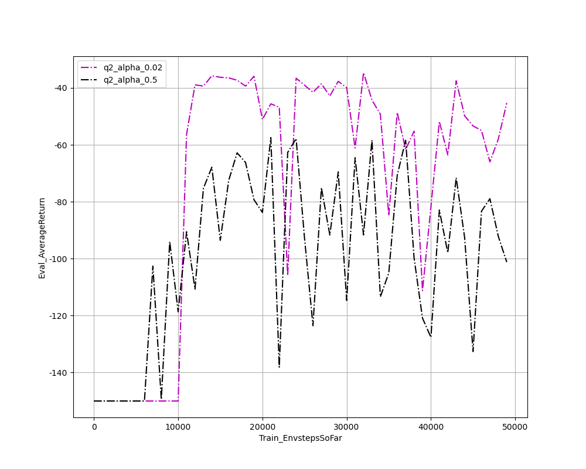
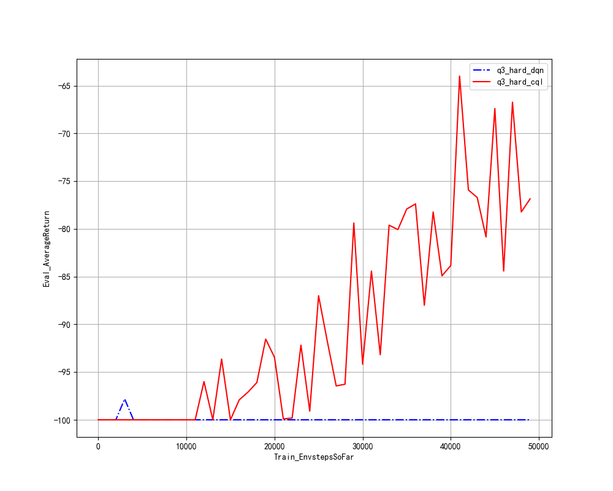
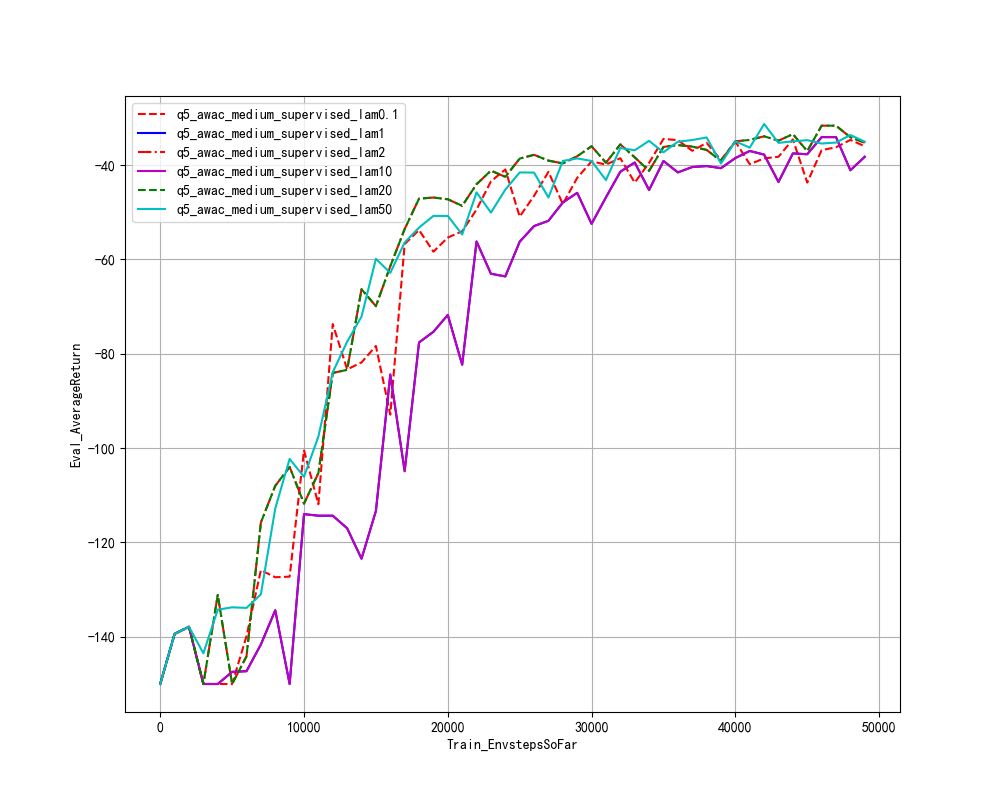
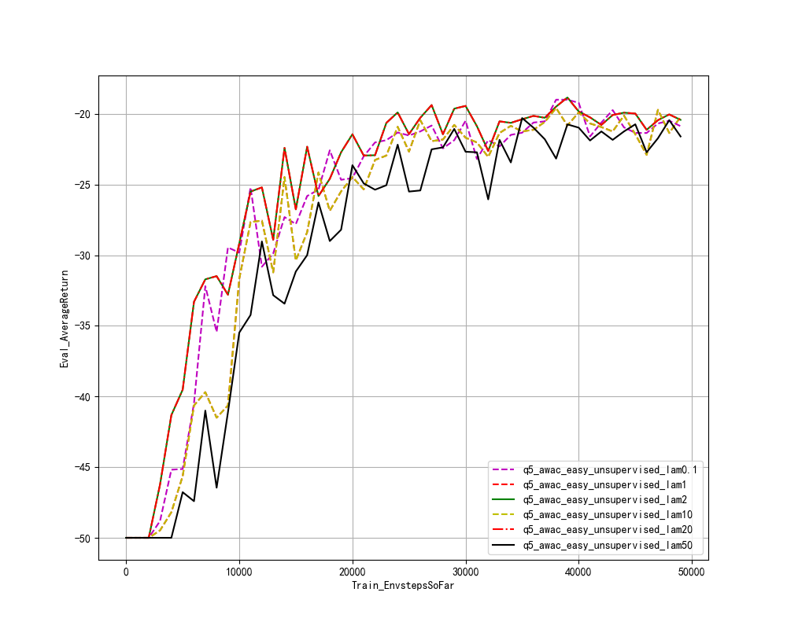

## q1

No matter in easy env or medium env, rnd group do better in exploration.

## q2

as the image shown, by using cql and make use of trick of reward scale and reward shift, the behaviors of the agents act better thans the dql algorighm.

the more numsteps of exploration, the bettter the behaivor.

cql_alpha = 0.5 behaves little worse than cql_alpha=0.02

## q3

the two pictures indicate that in hard pointmass, the exploration plays an important role in the performance of models.

## q4

the results above shows the performance of AWAC agents with different hyperparameter **awac_lambda** and **is_superviesed_exploration** in medium and easy pointmass environment.