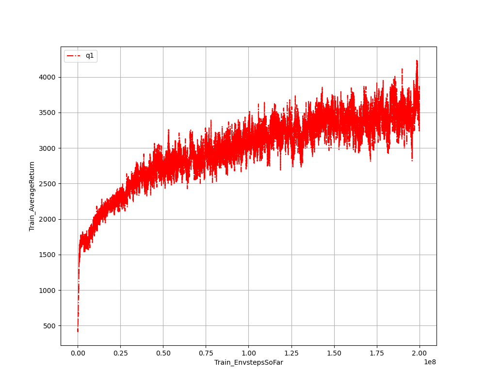
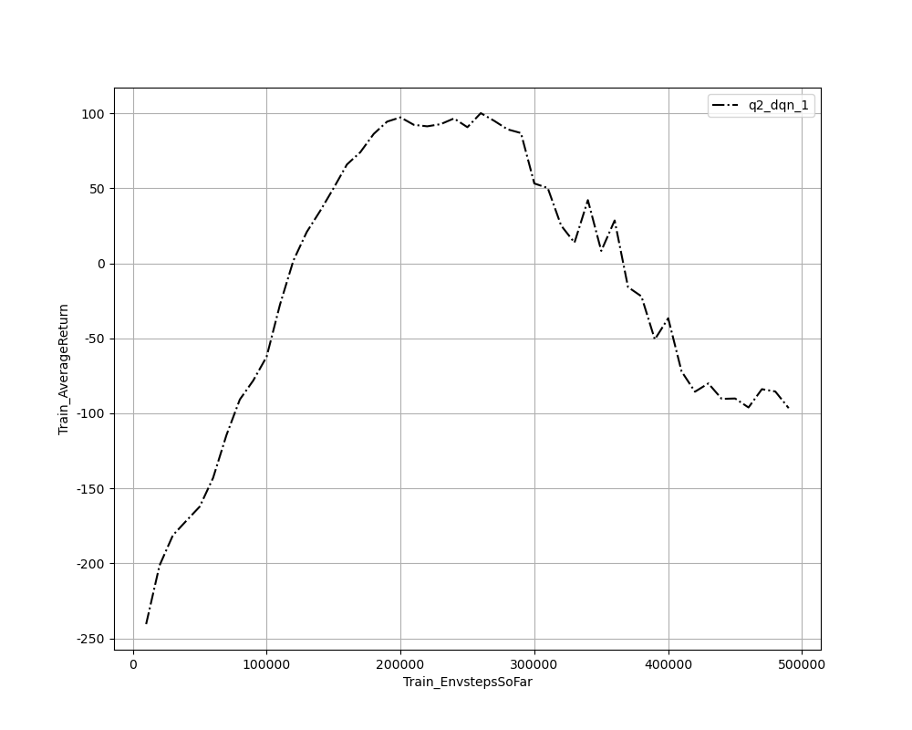
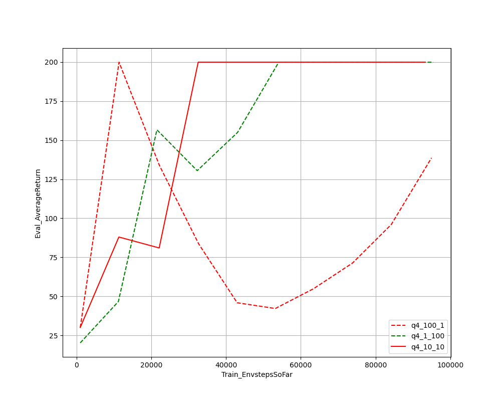
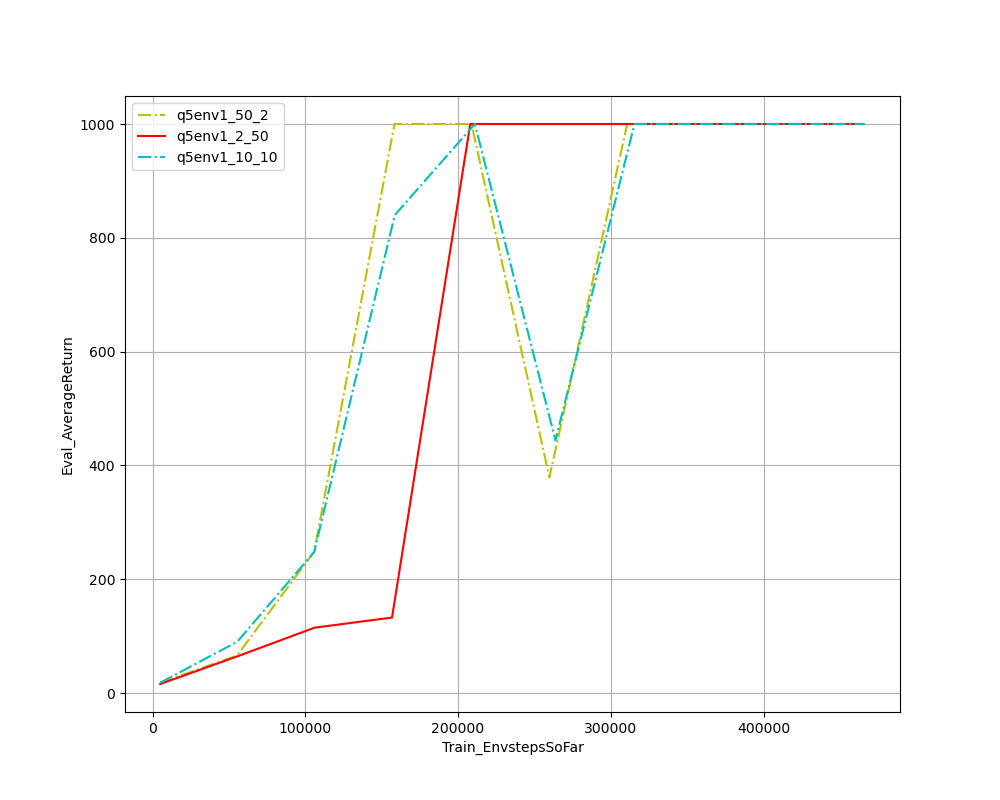
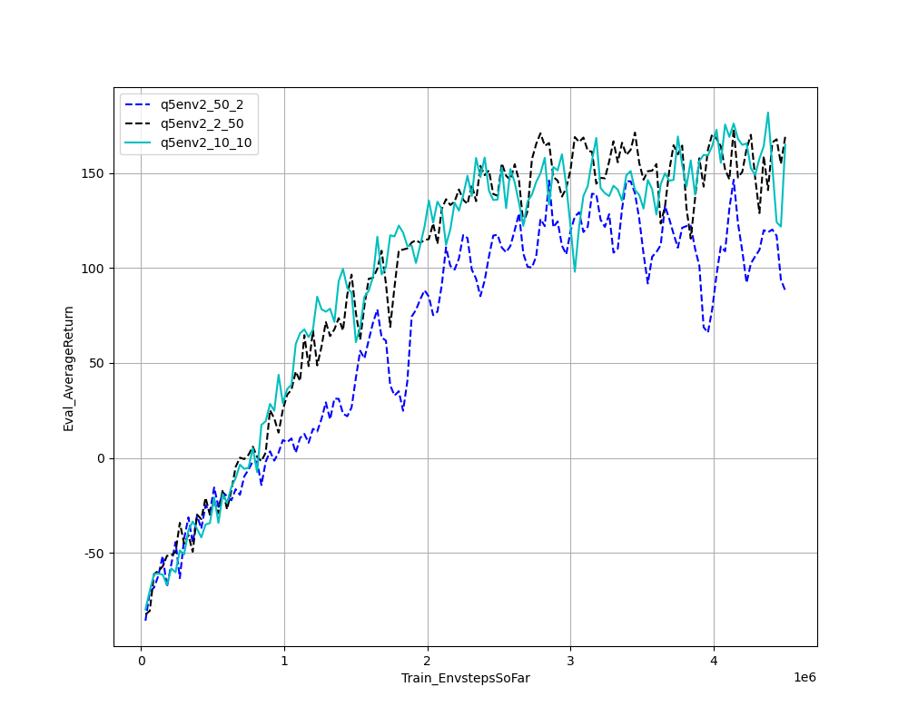

## Problem 1

when the algo implement 1e8 steps, we get score nearly 3000 which is higher than requirement of 1500 score.

## Problem 2

by using double dqn, the final performance is slightly higher than initial dqn.

## Problem 4

the group with num_target_updates=10, num_grad_steps_per_target_update=10 behaves the best, which reaches the expected score 200. 

## Problem 5
the following figures show the performance of actor-critic algorighm in more diffcult games.And Both of them reaches the requirements in [homework pdf](CS285_hw3.pdf)

